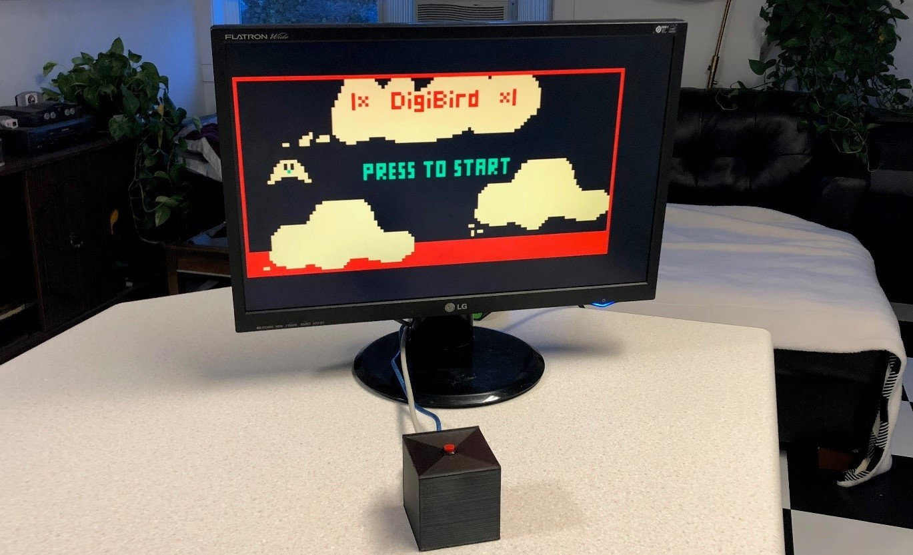
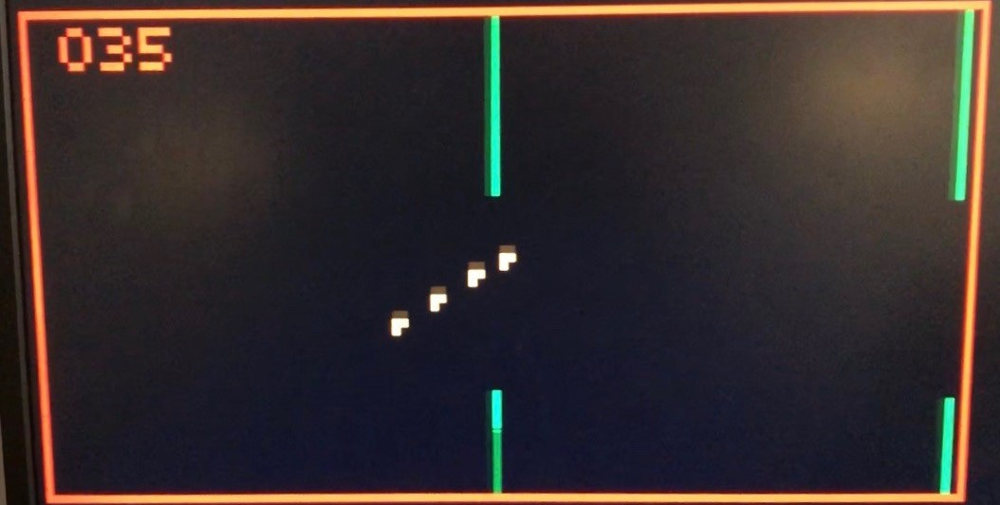

# Arduino Entertainment System

An Arduino based game console that uses the Video Graphics Array (VGA) standard to interface with a television or desktop monitor.

The VGAX library by Sandro Maffiodo is available at: https://github.com/smaffer/vgax

## Memory Management
### Flash: 
The program is stored in the flash memory. Since SRAM is valuable in this project the flash is used to store large data structures that go unmodified during runtime (the title and end screen data).
### SRAM: 
The sketch creates and modifies variables here during runtime. The VGAX library implements a frame buffer with the SRAM that takes up 1800Kb, this leaves 200Kb for the rest of the program to run so programs must be as efficient as possible to avoid unpredictable behavior. 
EEPROM: Long term variables (such as high score) can be stored here as the EEPROM is non volatile and may be written to during runtime unlike Flash. 

## VGA Shield PCB
The shield was designed using Fritzing. All the chip components are 1206 size, and JST connectors are used for board to case connections. All footprints were found in the fritzing library or online.

## DigiBird Game Operation
Fly through a maze of ever increasing difficulty and find friends on the way, be fast and precise to achieve the high score.

+ Bird ascends when button is held down
+ Bird descends when button is released
+ Walls travel from right to left
+ Hole size is generally decreased as game progresses
+ A sound is made when the bird safely flies through a wall
+ The score is incremented by 1 for every wall safely passed
+ The current score is displayed once every 5 walls
+ As the player progresses up to 5 birds will follow the main bird
+ If the main bird comes in contact with a wall the game ends
+ The achieved score and high score are displayed
+ At end screen player can push button to play again

